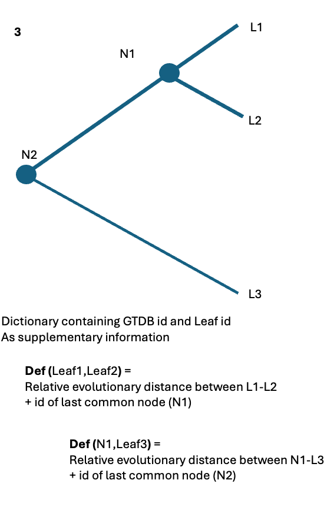

# redvals
Tool for obtaining RED values from GTDB phylogenetic trees


## Set Up
1. Clone repository
```
git clone https://github.com/HaigBishop/redvals.git
cd redvals
```
2. Install dependencies (biopython, pandas and tqdm)
```
conda install -c conda-forge biopython
conda install -c conda-forge pandas
conda install -c conda-forge tqdm
```
3. Use package
 - See usage below
 - Or see in depth examples in `example_1.py` and `example_2.py`


## Usage
#### Import redvals
```python
from redvals import RedTree
```

#### Load Undecorated Trees
```python
red_trees = RedTree("trees/bac120_r220.tree", "trees/ar53_r220.tree")
```

#### Decorate Trees from TSVs
```python
red_trees.decorate_from_tsv("red_values/gtdbtk_r220_bac120.tsv", "red_values/gtdbtk_r220_ar53.tsv")
```

#### Write Decorated Trees
```python
red_trees.write_decorated_trees("decorated_trees/bac120_r220_decorated.pkl", "decorated_trees/ar53_r220_decorated.pkl")
```

#### Load Decorated Trees
```python
red_trees = RedTree("decorated_trees/bac120_r220_decorated.pkl", "decorated_trees/ar53_r220_decorated.pkl")
```

#### Convert Node IDs
```python
bacterial_redvals_id = red_trees.get_redvals_id("GB_GCA_002687935.1")
gtdb_id = red_trees.get_gtdb_id("bac00000001")
```

#### Access Node Info
```python
node_info = red_trees.get_node_info("bac00000001")
print(f"RED value: {node_info.red_value}, Domain: {node_info.domain}")
```

#### Compute RED Distances
```python
red_distance, mrca_node_id = red_trees.dist_between_nodes("bac00000001", "RS_GCF_001186155.3")
```


## Files

### Original Newick Tree Files
#### ./trees/bac120_r220.tree and ./trees/ar53_r220.tree
These are the GTDB phylogenetic trees (release 220) in Newick format. Obtained from: https://gtdb.ecogenomic.org/downloads

Example usage:
```
from Bio import Phylo
# Load the Newick tree file of bacterial GTDB tree
bac120_tree = Phylo.read("./trees/bac120_r220.tree", "newick")
# Print some info about the tree
terminal_nodes = bac120_tree.get_terminals()
nonterminal_nodes = arc53_tree.get_nonterminals()
print("5 leaf node names:", [node.name for node in terminal_nodes[:5]])
print("5 internal node names:", [node.name for node in nonterminal_nodes[:5]])
print("Number of leaf nodes:", len(terminal_nodes))
print("Number of internal nodes:", len(nonterminal_nodes))
```

### RED Values TSV Files
#### ./red_values/gtdbtk_r220_bac120.tsv and ./red_values/gtdbtk_r220_ar53.tsv
These TSV files contain the RED values for all nodes in each tree. They originate from the release 220 gtdbtk_package directory from: https://gtdb.ecogenomic.org/downloads
i.e. https://data.ace.uq.edu.au/public/gtdb/data/releases/release220/220.0/auxillary_files/gtdbtk_package/full_package/

There is one row for each node (terminal and nonterminal). The second column holds the RED value assigned to the given node. The first column holds one or two leaf IDs (AKA genome IDs). For example in the first column we might find "GB_GCA_020721905.1" or "GB_GCA_026414805.1|GB_GCA_020721905.1". When there is a single leaf ID, this is a leaf node, and therefore the RED value in column two is 1.0. But if there are two leaf IDs seperated by a "|" symbol, this row represents an internal node. Specifically, it represents the node that is the most recent common ancestor (MRCA) of the two leaf IDs in column one.

### Decorated Tree Files
#### ./decorated_trees/bac120_r220_decorated.pkl and ./decorated_trees/ar53_r220_decorated.pkl
These files are Python pickle files, each containing a Bio.Phylo.Newick.Tree object. Loading these objects (see below) results in the same object as loading the .tree files (as above), but the difference is that they are decorated with RED values, and [TODO].

Example usage:
```
import pickle
from Bio import Phylo
# Load the pickle file of decorated bacterial GTDB tree
with open("./out/bac120_r220_decorated.pkl", "rb") as f:
    decorated_bac120_tree = pickle.load(f)

# Access some RED values using the tree
[TODO]
```


### Reference Diagram:



## TO DO
 - use verbose attribute
 - calculate RED values


